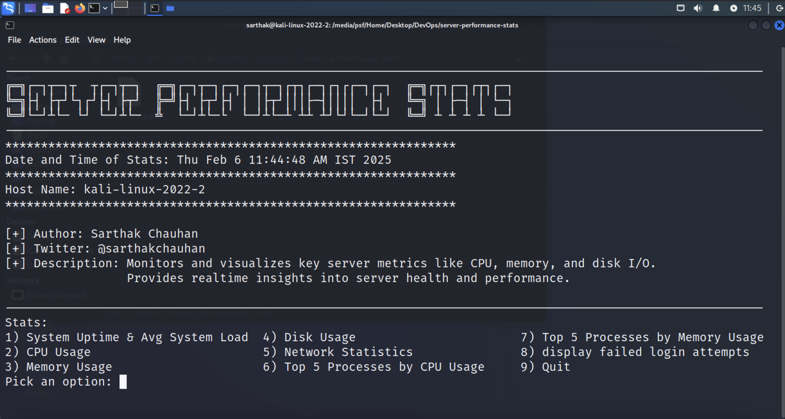

# Server Performance Stats

## Overview
This project is a shell script that provides essential server performance statistics, including CPU usage, memory usage, disk usage, network statistics, and top resource-consuming processes. It helps system administrators monitor server health and performance.



## Features
- Displays current date and time of the stats.
- Provides hostname information.
- Shows system uptime and average system load.
- Reports CPU, memory, and disk usage.
- Lists network statistics.
- Displays top CPU and memory-consuming processes.

## Usage
Run the script in a Linux-based environment:

```sh
chmod +x server_stats.sh
./server_stats.sh
```

## Sample Output
```
Date and Time of Stats: YYYY-MM-DD HH:MM:SS
********************************
Host Name: server_hostname
********************************
System Uptime & Avg System Load: uptime_info
********************************
CPU Usage: cpu_usage_percentage
********************************
Memory Usage: memory_usage_details
********************************
Disk Usage: disk_usage_details
********************************
Network Statistics:
network_statistics
********************************
Top CPU Consuming Processes:
top_cpu_processes
********************************
Top Memory Consuming Processes:
top_memory_processes
********************************
```

## Prerequisites
Ensure you have the following:
- A Linux-based operating system.
- Basic shell scripting knowledge.

## Installation
Clone the repository:
```sh
git clone https://github.com/Darkshadow-ssh/server-performance-stats.git
cd server-performance-stats
```

## Contributing
Contributions are welcome! Feel free to open an issue or submit a pull request.

## Author
[Sarthak Chauhan](https://github.com/Darkshadow-ssh)

